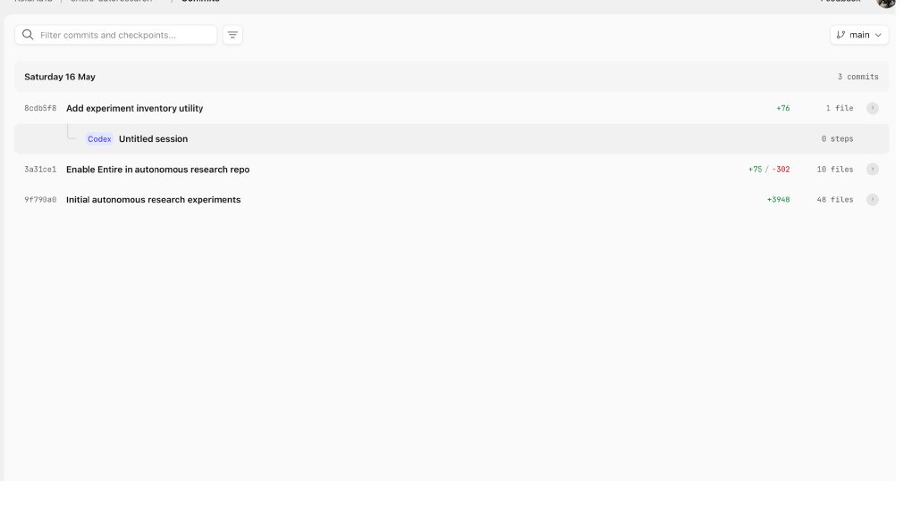
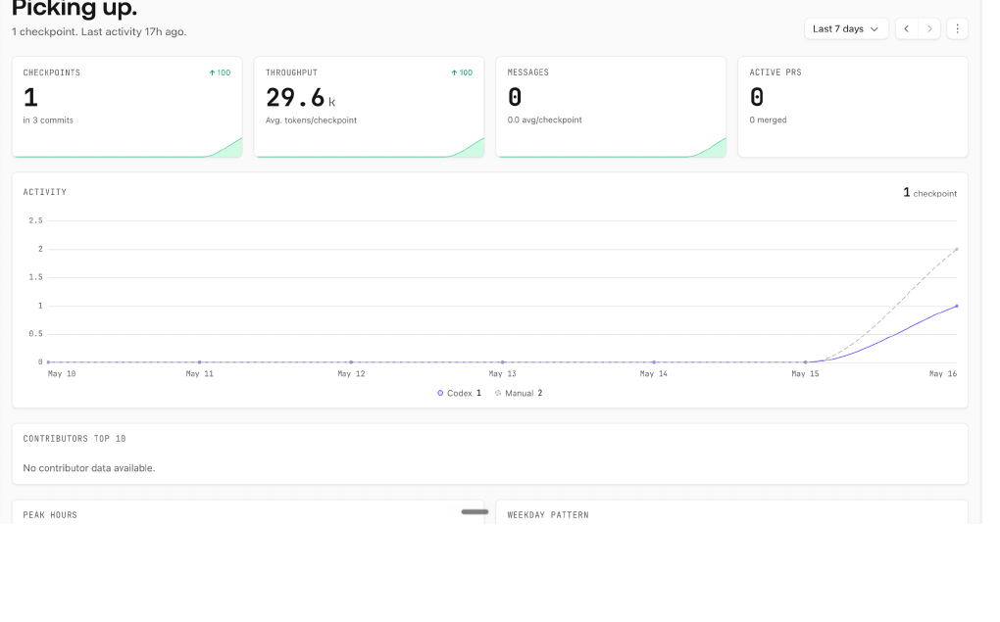

# Entire Autoresearch

This repository contains the technical artifacts for a Track 1 diligence test of Entire as a provenance and context layer for agent-assisted software work.

The core question is not whether the lightweight ML workloads are interesting. They are not the product claim. The question is whether Entire can make agent work reviewable, reproducible, and easier to continue by preserving the context behind code changes.

## Repository Structure

### `experiments/autonomous-research-system`

Builds a small autonomous research loop that creates the kind of messy workflow state agents produce: scripts, run manifests, decisions, metrics, generated artifacts, and follow-on changes.

Use this experiment to inspect:

- `scripts/autonomous_research_system.py`: the local autonomous loop implementation
- `results/run_manifest.json`: run metadata and trial records
- `results/decisions.jsonl`: decision trace for the run
- `results/trajectory.csv`: compact trial trajectory
- `results/entire_fit_scorecard.json`: what a provenance layer should capture

### `experiments/autonomous-provenance-ledger`

Compares Entire checkpoint evidence against the broader context required to understand an agentic research session.

Use this experiment to inspect:

- `scripts/build_ledger.py`: builds a joined provenance ledger
- `inputs/`: copied checkpoint and run evidence
- `results/provenance_ledger.json`: structured summary of what was captured and what had to be joined from external artifacts

### `experiments/cross-layer-log-joiner`

Tests whether failures are visible when joining checkpoint evidence with shell output, direct CLI output, search output, and status logs.

Use this experiment to inspect:

- `scripts/join_logs.py`: joins failure evidence across sources
- `inputs/`: checkpoint, CLI, search, and status evidence
- `results/joined_failure_ledger.json`: failure categories and which layers surfaced them

### `experiments/lightweight-ml-research-infra`

Creates lightweight research-workflow artifacts such as dataset cards, model cards, metrics, and checkpoints. The ML scores are not used as diligence evidence about Entire. This folder exists to create realistic research state for provenance testing.

Use this experiment to inspect:

- `scripts/lightweight_ml_suite.py`: NumPy-based workflow artifact generator
- `scripts/torch_ml_suite.py`: PyTorch-based workflow artifact generator
- `results/`: generated metrics, dataset cards, model cards, run manifests, and checkpoints

## Utility

`tools/experiment_inventory.py` scans `experiments/` and prints a JSON inventory of each experiment's code files and result artifacts.

Run:

```bash
python3 -B tools/experiment_inventory.py | python3 -m json.tool
```

## Entire Evidence

The strongest live Entire checkpoint from this repository is:

- Checkpoint: `983891961bcc`
- Commit: `8cdb5f8 Add experiment inventory utility`

Locally, `entire checkpoint explain 983891961bcc` showed the prompt, transcript, tool calls, verification, token usage, author, and linked commit. This is the core product evidence: Entire exposes context behind a code change that GitHub cannot infer from the diff alone.

## Cloud UI Screenshots

### Commit-level checkpoint view



This screenshot shows Entire Cloud displaying the `entire-autoresearch` commits and attaching a Codex checkpoint under commit `8cdb5f8 Add experiment inventory utility`.

What it proves:

- Entire Cloud can see the GitHub-backed repository.
- The checkpoint is linked to the specific commit it explains.
- The UI is close to the right review workflow because the checkpoint appears near the code change.

Product critique:

- The checkpoint row says `Untitled session`, which hides the most important review field: task intent.
- The row reports `0 steps`, even though the local checkpoint explain output contains tool calls and verification.
- The review surface should make actions like opening the transcript, inspecting tool calls, and checking verification more obvious.

### Overview dashboard



This screenshot shows the repository-level dashboard after Entire indexed the test repository.

What it proves:

- Entire registered one checkpoint across three commits.
- The dashboard tracks high-level activity, token usage, messages, active PRs, and contributors.

Product critique:

- The dashboard is analytics-first, while the strongest product wedge is review-first.
- `Messages 0` is confusing because the checkpoint has a transcript locally.
- The token count shown in the dashboard appears to use a different definition than the local checkpoint output, which needs clearer labeling.
- `No contributor data available` feels under-indexed given that local checkpoint metadata includes author information.
